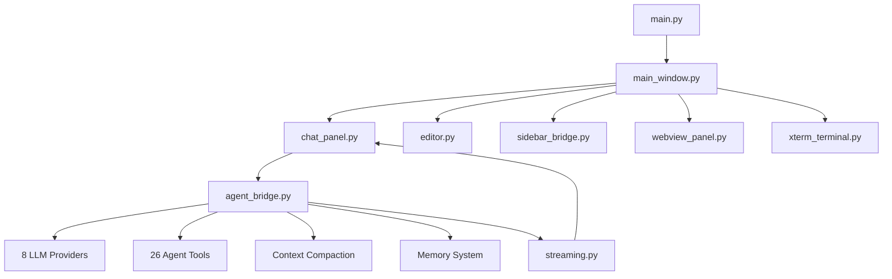

# Cortex Engine — Project Index

_Regenerated: 2026-06-26_

## Overview

**Cortex Engine** is a desktop AI IDE built with **PyQt6 + Qt WebEngine** that wraps a multi-provider LLM agent with 26 coding tools inside a Monaco-editor-based shell. It supports autonomous coding, streaming responses, crash persistence, semantic search, and plugin extensibility.

---

## Key Metrics

| Metric | Value |
|--------|-------|
| Python files | **563** |
| Lines of code | **142,871** |
| Agent tools | **26** |
| LLM providers | **8** |
| HTML assets | **6** |
| CSS assets | **2** |
| JS assets | **6** |

---

## Module Breakdown

| Module | Files | Lines | Share | Purpose |
|--------|------:|------:|------:|---------|
| `agent/` | 438 | 73,827 | 51.7% | Tools, services, utilities, permissions, MCP, plugins |
| `ui/` | 34 | 23,718 | 16.6% | Chat panel, editor, sidebar, terminal, dialogs, tool cards |
| `ai/` | 27 | 20,189 | 14.1% | Agent bridge (core AI brain), 8 providers, streaming, safety |
| `core/` | 29 | 10,174 | 7.1% | Database, crash recovery, embeddings, git, memory |
| `main_window.py` | 1 | 6,459 | 4.5% | IDE shell window, menus, tabs, DWM, status bar |
| `utils/` | 19 | 5,267 | 3.7% | Icons, language detection, git helpers, logging |
| `coordinator/` | 4 | 938 | 0.7% | Agent coordination |
| `services/` | 3 | 720 | 0.5% | Background services |
| `config/` | 4 | 538 | 0.4% | Configuration management |
| `main.py` | 1 | 706 | 0.5% | Entry point, Qt setup, DPI scaling |
| `plugin/` | 2 | 334 | 0.2% | Plugin framework |

---

## Top 20 Largest Files

| # | File | Lines | Role |
|---|------|------:|------|
| 1 | `ai/agent_bridge.py` | 10,928 | Core AI brain: tool dispatch, streaming, memory, compaction, crash recovery |
| 2 | `ui/chat_panel.py` | 7,009 | Chat UI: message rendering, tool cards, streaming cursor, scroll management |
| 3 | `main_window.py` | 6,459 | IDE shell: window chrome, menus, tabs, DWM, status bar, project management |
| 4 | `ui/components/editor.py` | 2,514 | Monaco editor wrapper: code editing, syntax highlighting, tab management |
| 5 | `agent/src/tools/BashTool/bashPermissions.py` | 2,284 | Bash command permission logic and sandboxing |
| 6 | `agent/src/services/compact/compact.py` | 1,940 | Context compaction and conversation summarization |
| 7 | `agent/src/tools/FileReadTool/FileReadTool.py` | 1,837 | File reading with line numbers, offset, encoding handling |
| 8 | `core/database.py` | 1,644 | SQLite database: sessions, messages, projects, embeddings |
| 9 | `agent/src/services/mcp/config.py` | 1,462 | Model Context Protocol configuration and server management |
| 10 | `agent/src/utils/permissions/yoloClassifier.py` | 1,403 | Auto-approve/reject classifier for tool permissions |
| 11 | `agent/src/utils/permissions/permissions.py` | 1,324 | Permission system: allow/deny rules, trust levels |
| 12 | `agent/src/tools/BashTool/pathValidation.py` | 1,323 | Path validation and traversal attack prevention |
| 13 | `ui/components/sidebar_bridge.py` | 1,305 | HTML sidebar <-> Python bridge via QWebChannel, file tree ops |
| 14 | `utils/language_detector.py` | 1,300 | Programming language detection from file extensions and content |
| 15 | `agent/src/tools/BashTool/bashSecurity.py` | 1,284 | Bash command security analysis and injection prevention |
| 16 | `agent/src/utils/plugins/installedPluginsManager.py` | 1,267 | Plugin lifecycle management and installation |
| 17 | `agent/src/utils/config.py` | 1,215 | Agent configuration management |
| 18 | `agent/src/tools/GrepTool/GrepTool.py` | 1,182 | Regex content search across codebase |
| 19 | `utils/icons.py` | 1,180 | Icon management and SVG loading |
| 20 | `agent/src/services/PromptSuggestion/speculation.py` | 1,120 | Speculative prompt suggestion engine |

---

## Agent Tools (26)

### File Operations
| Tool | Files | Lines | Description |
|------|------:|------:|-------------|
| `FileReadTool` | 5 | 2,098 | Read files with line numbers, offset/limit, encoding |
| `FileEditTool` | 6 | 2,435 | Search-and-replace edits with diff preview |
| `FileWriteTool` | 3 | 862 | Create/overwrite files |
| `GlobTool` | 3 | 469 | File pattern matching |
| `GrepTool` | 3 | 1,249 | Regex content search |
| `NotebookEditTool` | 4 | 482 | Jupyter notebook cell editing |

### Execution
| Tool | Files | Lines | Description |
|------|------:|------:|-------------|
| `BashTool` | 15 | 7,626 | Shell command execution with sandboxing |
| `PowerShellTool` | 10 | 3,166 | PowerShell-specific execution |
| `REPLTool` | 1 | 98 | Python REPL execution |

### Search & Intelligence
| Tool | Files | Lines | Description |
|------|------:|------:|-------------|
| `SementicSearch` | 3 | 700 | Natural language code search via embeddings |
| `WebSearchTool` | 3 | 346 | Web search via API |
| `WebFetchTool` | 6 | 441 | URL content fetching and extraction |
| `ToolSearchTool` | 3 | 549 | Search available tools by capability |

### Planning & Workflow
| Tool | Files | Lines | Description |
|------|------:|------:|-------------|
| `TodoWriteTool` | 3 | 496 | Task list management |
| `EnterPlanModeTool` | 3 | 276 | Switch to planning mode |
| `ExitPlanModeTool` | 3 | 32 | Exit planning mode |
| `PlanBuildTool` | 3 | 264 | Build execution plans |
| `SkillTool` | 4 | 620 | Reusable skill invocation |

### Communication
| Tool | Files | Lines | Description |
|------|------:|------:|-------------|
| `AskUserQuestionTool` | 2 | 294 | Ask user multiple-choice questions |
| `SendMessageTool` | 3 | 653 | Inter-agent messaging |
| `AgentTool` | 12 | 2,782 | Sub-agent spawning and management |

### Utilities
| Tool | Files | Lines | Description |
|------|------:|------:|-------------|
| `VisionAgentTool` | 2 | 157 | Image analysis |
| `SleepTool` | 1 | 25 | Delay execution |
| `ListMcpResourcesTool` | 2 | 167 | List MCP server resources |

---

## LLM Providers (8)

| Provider | File | Lines | Models |
|----------|------|------:|--------|
| OpenAI | `openai_provider.py` | 468 | GPT-4o, GPT-4.1, o3, o4-mini, codex |
| DeepSeek | `deepseek_provider.py` | 673 | DeepSeek Chat, DeepSeek Reasoner |
| Mistral | `mistral_provider.py` | 891 | Mistral Large, Codestral |
| Alibaba (Qwen) | `alibaba_provider.py` | 607 | Qwen models |
| Kimi | `kimi_provider.py` | 373 | Moonshot models |
| MiMo | `mimo_provider.py` | 800 | MiMo reasoning models |
| OpenRouter | `openrouter_provider.py` | 777 | Multi-model gateway |
| SiliconFlow | `siliconflow_provider.py` | 296 | Chinese model gateway |

---

## Architecture



### Data Flow

```
User Input -> chat_panel.py -> agent_bridge.py -> LLM Provider
    |              |               |
  Monaco      Tool Cards      Tool Execution
  Editor      Streaming       (Bash, File, etc.)
              Response            |
                              Result -> agent_bridge -> chat_panel -> Display
```

---

## Directory Tree

```
cortex-Cortex-Engine/
├── main.py
├── main_window.py
├── PROJECT_INDEX.md
├── MEMORY.md
├── Docs/
│   ├── SETTINGS_DESIGN_CONCEPT.md
│   ├── MENU_STATUS_AUDIT.md
│   ├── CHAT_PANEL_STREAMING_FLICKER_ANALYSIS_2026-06-24.md
│   ├── RENAME_DELETE_SIGNAL_CHAIN_ANALYSIS_2026-06-24.md
│   ├── AI_MODEL_REFERENCE.md
│   └── prompt.md
├── .cortex/
└── src/
    ├── agent/         (73,827 lines)
    │   └── src/
    │       ├── tools/       (26 tools)
    │       ├── services/    (compaction, MCP)
    │       └── utils/       (permissions, plugins)
    ├── ai/            (20,189 lines)
    │   ├── agent_bridge.py  (10,928 lines)
    │   └── providers/       (8 LLM providers)
    ├── core/          (10,174 lines)
    ├── ui/            (23,718 lines)
    ├── utils/         (5,267 lines)
    └── assets/        (editor HTML, logos)
```

---

## Recent Changes (since commit 1456762)

| Change | Files | Details |
|--------|-------|---------|
| Sidebar rename/suppress watcher | `sidebar.html`, `sidebar_bridge.py` | Fixed tree rebuild during rename |
| Editor rename support | `editor.html`, `webview_panel.py` | Added `renameFileTab()` |
| Streaming UX fixes | `chat_panel.py` | Fixed text slip, flicker, scroll disruption |
| Signal chain fixes | `sidebar_bridge.py`, `main_window.py` | `file_renamed` signal propagation |
| Notification overhaul | `notifications.py` | Windows toast notifications |
| Settings page | `memory_management.html/css/js` | Full settings UI with 15 sections |
| Dead code cleanup | 90+ files removed | Net reduction of ~16,748 lines |
